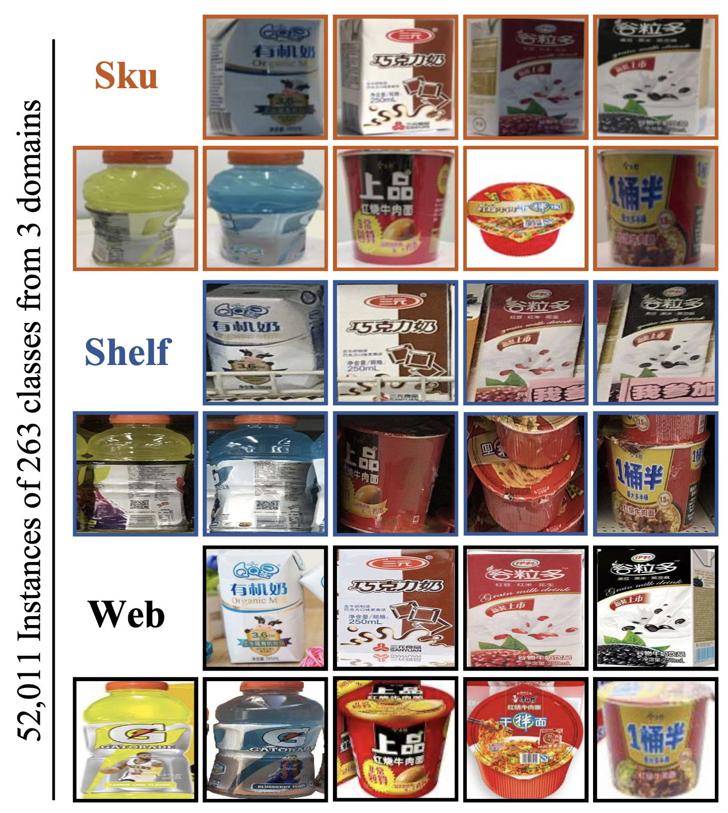
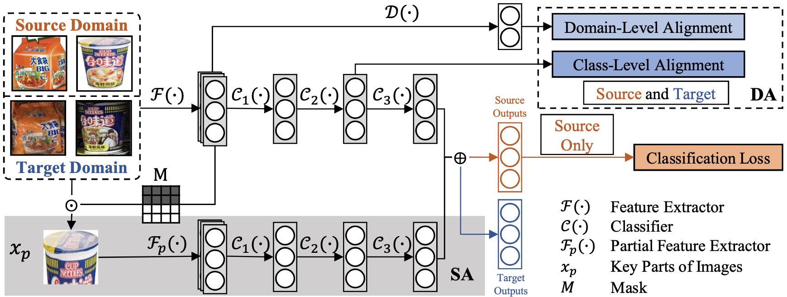
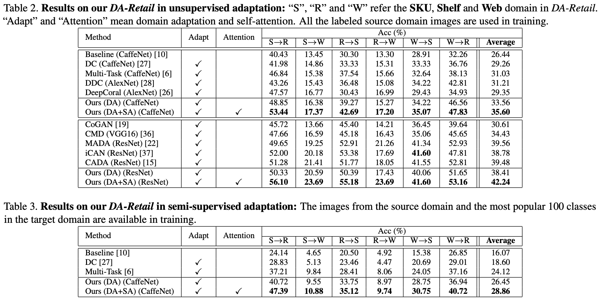

<head>
    <meta charset="UTF-8">
    <title>DA-Retail Dataset Project Page</title>
    <meta name="description" content="A Large-Scale Retail Product Checkout Dataset">
    <meta name="keywords" content="rpc dataset, rpctool, retail, product detection">
    <link rel="shortcut icon" href="./favicon.ico">
</head>

<div align="center">

# An Adversarial Domain Adaptation Network for Cross-Domain Fine-Grained Recognition

**[Yimu Wang<sup>1</sup>](https://yimuwang96.github.io/) &nbsp;&nbsp;&nbsp;Ren-Jie Song<sup>2</sup> &nbsp;&nbsp;&nbsp;[Xiu-Shen Wei<sup>2</sup>](http://www.weixiushen.com/) &nbsp;&nbsp;&nbsp;[Lijun Zhang<sup>1</sup>](https://cs.nju.edu.cn/zlj/) &nbsp;&nbsp;&nbsp;**

<sup>1</sup>Department of Computer Science and Technology, Nanjing University, Nanjing, China    
<sup>2</sup>Megvii Research Nanjing, Megvii Technology Ltd., Nanjing, China    

---

 ### [Abstract](#1-abstract) | [Paper](#2-paper) | [Dataset](#3-DA-Retail) | [Proposed Method](#4-proposed-method-on-the-da-retail-dataset) | [Cite](#5-cite)
</div>

## 1. Abstract

<p style="text-align: justify"><em>&nbsp;&nbsp;&nbsp;&nbsp;&nbsp;In this paper, we tackle a valuable yet very challenging visual recognition task, where the instances are within a sub- ordinate category, and the target domain undergoes a shift with the source domain. This task, termed as cross-domain fine-grained recognition, relates closely to many real-life sce- narios, e.g., recognizing retail products in storage racks by models trained with images collected in controlled environ- ments. To deal with this problem, we design a new algorithm and propose a corresponding fine-grained domain adapta- tion dataset. Firstly, we propose a novel end-to-end CNN architecture that integrates two specialized modules: an ad- versarial module for domain alignment and a self-attention module for fine-grained recognition. The adversarial module is used to handle domain shift by gradually aligning the dif- ferent domains with domain-level and class-level alignments, and strive to help the classifier learn with domain-invariant features generated by nets. The self-attention module is de- signed to capture discriminative image regions which are crucial for fine-grained visual recognition. Secondly, we col- lect a large-scale fine-grained domain adaptation dataset of retail products, which contains 52,011 images of 263 classes from 3 domains. Thirdly, we validate the effectiveness of our method on three datasets, showing that the proposed method can yield significant improvements over baseline methods on fine-grained datasets. Besides, we also evaluate the effectiveness of the self-attention module by performing visualization, which can capture the discriminative image regions in both source and target domains.
</em></p>

## 2. Paper

<div align="center">  

[**Paper will be released after the conference!**](NULL)

</div>

## 3. Our DA-Retail dataset 

<div align="left">

DA-Retail consists of 52,011 images of 263 fine-grained classes from 3 domains. Abundant images from multiple sources make our dataset more challenging. The collected fine-grained products are from the retail scenario, e.g., istant noodles, fruit juice, mineral water, yogurt, and milk.

</div>


<div align="center">

[**Dataset will be released after the conference!**](NULL)

<div align="center">
    

</div>

</div>


Dataset license:  
[](https://creativecommons.org/licenses/by-nc-sa/4.0/)    
CC BY-NC-SA 4.0


## 4. Proposed method on the DA-Retail dataset

#### 4.1 Pipeline of our method

<div align="center">
    

</div>

#### 4.2 Experimental results

<div align="center">
    
</div>


#### 4.3 Source Codes

<div align="center">

[**Source codes will be released after the conference!**](NULL)

</div>

## 5. Cite

<div align="left">

```
@inproceedings{wang20,
  title = {An Adversarial Domain Adaptation Network for Cross-Domain Fine-Grained Recognition},
  author = {Yimu Wang and Ren-Jie Song and Xiu-Shen Wei and Lijun Zhang},
  booktitle = {European Conference on Computer Vision},
  year = {2020}
}
```

</div>


<!-- Global site tag (gtag.js) - Google Analytics -->

<script async src="https://www.googletagmanager.com/gtag/js?id=UA-133191784-1"></script>
<script>
  window.dataLayer = window.dataLayer || [];
  function gtag(){dataLayer.push(arguments);}
  gtag('js', new Date());
  gtag('config', 'UA-133191784-1');
</script>
